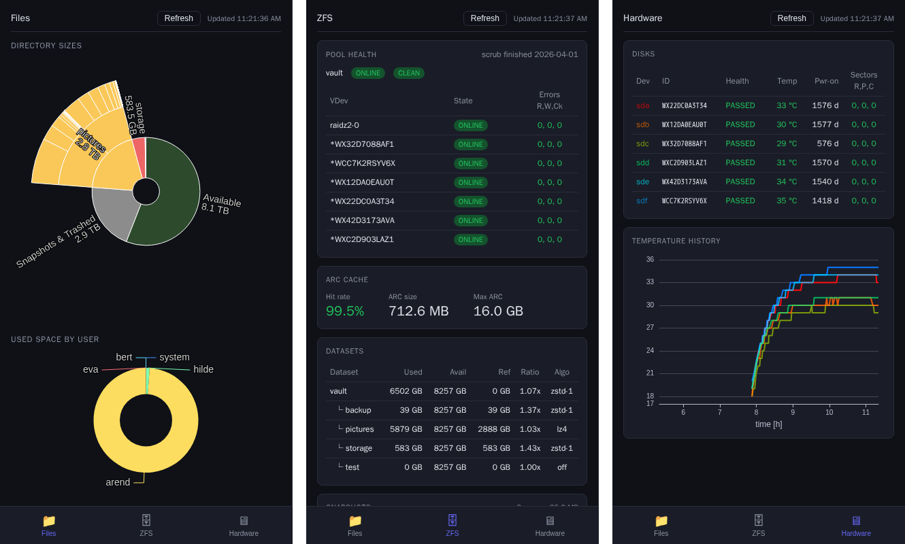

# zfs-nas-dashboard

[](https://github.com/abaeyens/zfs-nas-dashboard/actions/workflows/ci.yml)
[](https://goreportcard.com/report/github.com/abaeyens/zfs-nas-dashboard)
[](LICENSE.txt)
[](https://go.dev/)
[](https://hub.docker.com/)


Read-only browser dashboard for a ZFS NAS.
Three panes — **Files**, **ZFS**, **Hardware** —
served from a single Docker container, with no external runtime dependencies.


_On mobile, also works perfectly on desktop screens of various sizes_

## Requirements

- Ubuntu/Debian host with ZFS
- Docker Engine + Compose v2
- Block device access for each disk in the pool (`/dev/sdX` or by-id)

## Setup

### 1. Configure pool and disks

Edit `docker-compose.yml` and set the four things specific to your system:

**Pool identity** — under `environment:`
```yaml
POOL_PATH: /vault   # absolute path where the pool is mounted on the host
POOL_NAME: vault    # name shown by `zpool list`
```

**Pool volume** — under `volumes:` (so the container can run `du`/`find`)
```yaml
- /vault:/vault:ro  # replace /vault with your POOL_PATH
```

**Disk devices** — under `devices:` (so `smartctl` can read SMART data):
```yaml
devices:
  - /dev/sda                              # block device for each disk in the pool
  - /dev/disk/by-id/ata-WDC_WD40EFAX-...  # corresponding stable by-id symlink
```
You need both the `/dev/sdX` entry (for kernel sysfs device-type detection) and the by-id symlink (used as the stable disk identifier in the UI). List available by-id names with:
```bash
ls -la /dev/disk/by-id/ | grep -v part
```

### 2. Build and bringup

```bash
make up
```

and in your browser, open [http://localhost:8080](http://localhost:8080).

## Configuration

All settings are environment variables in `docker-compose.yml`:

| Variable | Default | Description |
|---|---|---|
| `POOL_PATH` | *(required)* | Absolute mount path of the pool (e.g. `/tank`) |
| `POOL_NAME` | *(required)* | ZFS pool name (e.g. `tank`) |
| `PORT` | `8080` | Port on which to serve the dashboard |
| `SCAN_DEPTH` | `5` | Directory scanning depth for the sunburst chart |
| `TEMP_HISTORY_HOURS` | `6` | Hours of disk temperature history to retain |
| `SMART_POLL_INTERVAL` | `60` | How often to poll disk status (seconds) |
| `FILES_REFRESH_INTERVAL` | `300` | How often to update the sunburst files chart (seconds) |
| `ZFS_REFRESH_INTERVAL` | *(same as `FILES_REFRESH_INTERVAL`)* | How often to refresh ZFS pool / dataset / snapshot info (seconds) |
| `TEMP_WARN_C` | `45` | Disks temperature warning threshold (°C) |
| `TEMP_CRIT_C` | `55` | Disks temperature critical threshold (°C) |
| `REALLOC_WARN` / `REALLOC_CRIT` | `1` / `5` | Disks reallocated sectors thresholds |
| `PENDING_WARN` / `PENDING_CRIT` | `1` / `5` | Disks pending sectors thresholds |
| `UNCORR_WARN` / `UNCORR_CRIT` | `1` / `5` | Disks uncorrectable error thresholds |
| `DATA_DIR` | `/data` | Where to store database with temperature history |

---

## Deployment

The production image is a slim Debian Bookworm runtime with just the
compiled binary plus `smartmontools` and `zfsutils-linux` — no Go toolchain
and no source tree. It is built in two stages from [`Dockerfile`](Dockerfile);
the resulting image is roughly 150 MB.

| Command | Effect |
|---|---|
| `make up` | Build the production image and start the container |
| `make down` | Stop and remove the production container |
| `make restart` | Restart the production container |
| `make logs` | Follow production container logs |
| `make image` | Build the production image without starting the container |

## Development

For iterating on the code, [`make dev`](Makefile) starts a separate
container built from [`Dockerfile.dev`](Dockerfile.dev) — same system
tools as production, plus the Go toolchain, prettier, and Claude Code.
The source tree is bind-mounted at `/app`, and `go run` recompiles on
each `make dev-restart`.

| Command | Effect |
|---|---|
| `make dev` | Build the dev image and start the dev container |
| `make dev-down` | Stop and remove the dev container |
| `make dev-restart` | Restart the dev container (re-runs `go run`) |
| `make dev-logs` | Follow dev container logs |
| `make shell` | Shell inside whichever container is running |
| `make test` | Run all Go tests (requires the dev container to be up) |
| `make build` | Compile the binary inside the dev container (sanity check) |
| `make fmt` | Format Go (`gofmt`) and frontend (`prettier`) files |
| `make claude` | Run Claude Code interactively inside the dev image |
| `make screenshot` | Generate screenshots into `docs/screenshots/` (requires running container) |

The dev and production containers share the same `container_name`, so only
one of them can be running at a time — `make dev` after `make up` will
swap the production container for the dev container in place.


## Architecture
Go backend serving a HTML/CSS/JS frontend.
The frontend gets its data from the REST endpoints exposed by the backend,
and the backend notifies the frontend of new data being available using SSE.
See [architecture.md](docs/architecture.md) for the component design and data-flow diagram.

| Package | Role |
|---|---|
| `internal/config` | Parse env vars → typed `Config` struct |
| `internal/collector` | Pure functions: run system commands, return typed structs |
| `internal/store` | SQLite temperature history |
| `internal/broker` | SSE fan-out |
| `internal/poller` | Background goroutines, in-memory caches |
| `internal/handler` | HTTP router; reads caches, never calls collectors directly |
| `web/` | Embedded HTML/CSS/JS (ECharts), built into the binary |


## Issues and feature requests
Something not working as expected? Missing feature?
Please open a GitHub issue, or send me an email.
